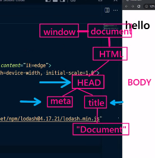

## DOM

: Document Object Model

: 구조화된 문서에서 구성 요소를 하나의 객체로 취급하여 다루는 논리적 트리 모델

## DOM-Tree

: meta와 title은 형제 노드

: document는 title의 자식 노드

: document는 자식 노드를 가질 수 없기 때문에 잎 노드라고 부르기도 함!

: html 하위 태그는 자식노드라고 생각하면 됨

: window는 최상위 객체이므로 js로 어디서든 참조 가능함 -> 이를 '전역개체' 라고 함

## querySelector, querySelectorAll

: querySelectorAll로 가져오면 유사배열이라고 함

## innerHTML, outerHTML

: 

## Node 참조

: textContent 옵션 = 

## setAttribute(name, value), getAttribute(attrivuteName)

: 속성명은 대소문자를 구별하지 않음(Style, sTyle => style)

## className 

: JS를 활용하여 클래스를 변경해주기 위한 메서드

: classList -> 용법 자세하게 공부하고 알아보기

## Event

: addEventListener를 주로 많이 활용함!

: 익명함수를 넣어버리면 삭제나 다룰 수 없다 -> 함수를 선언해준 후 집어넣어야함

: target 속성을 활용하여 지금 상호작용하는 부분이 어느 부분인지 판단할 수 있음

### Event bubbling

: content와 하위 영역에 이벤트를 달았을때 두번 호출이 되어서 이벤트가 중복해서 일어나는 경우

